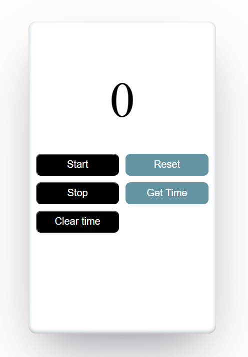

# ⏱ Stopwatch Project  
A simple and responsive Stopwatch application with essential time-tracking features.

## 🚀 Features:  
- **Start** ⏳ – Begin tracking time.  
- **Stop** ⏹ – Pause the stopwatch.  
- **Clear Time** 🔄 – Reset the displayed time.  
- **Get Time** 🕒 – Retrieve the current elapsed time.  
- **Reset** ♻️ – Completely reset the stopwatch.  

## 📌 Technologies Used:  
- **HTML** – Structure of the stopwatch.  
- **CSS** – Styling for a sleek UI.  
- **JavaScript** – Core logic for stopwatch functionality.  
